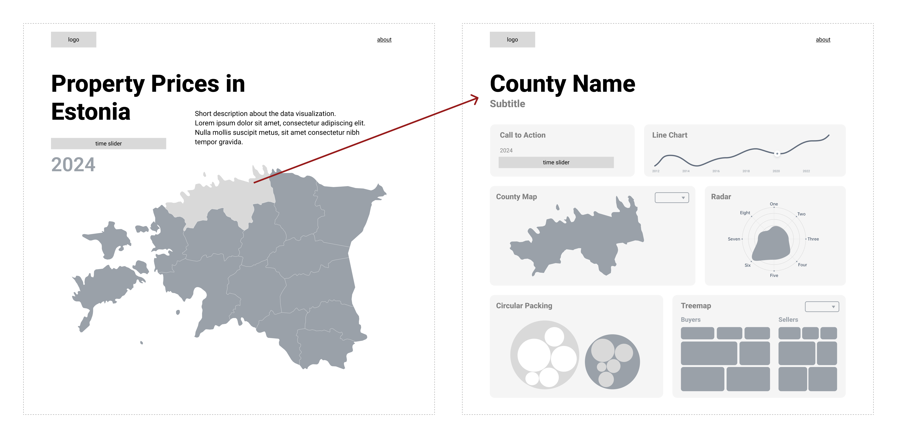

# 📝 Milestone 2

Real estate prices, their geographical distribution, and trends over time provide **critical insights** into a country's economy, wealth distribution, and urban development. Our goal is to present these insights through **intuitive and visually compelling dashboards** that make complex data easy to understand.

## Overview of the Visualization

Our data visualization project consists of two main components:
1. **Landing Page**: Provides a high-level overview of real estate trends across counties.
2. **County-Specific Dashboards**: Offers a deep dive into detailed metrics for individual counties.

## Landing Page

The landing page is designed to be **simple yet informative**, offering users a bird's-eye view of real estate trends at the county level. Key features include:

- **County-Level Yearly Average Transaction Prices**: Displayed on an interactive map.
- **Time-Slider**: Allows users to explore how prices have evolved over the years.
- **Hover and Click Interactions**:
  - Hovering over a county reveals a pop-up with summary statistics (e.g., average price, median price).
  - Clicking on a county redirects users to its corresponding county-specific dashboard.

This page serves as the entry point for users to explore temporal and spatial trends in real estate prices.

## County-Specific Dashboards

The county-specific dashboards provide a more granular view of real estate data, offering multiple visualizations and statistics. These dashboards include:

1. **Line Chart**: Displays price dynamics over time and doubles as a time-slider for the dashboard.
2. **Key Statistics**: Highlights essential metrics such as the selected year's average transaction price and average salary for the county.
3. **Detailed Map**: Focuses on parish-level (commune-level) data within the selected county.
4. **Radar Chart**: Illustrates the distribution of transactions by land type (e.g., residential, agricultural).
5. **Circular Packing Chart**: Visualizes land use categories in a hierarchical bubble format.
6. **Treemap**: Highlights non-local transactions based on buyer and seller locations.

Each visualization is designed to complement the others, providing users with a comprehensive understanding of real estate trends in the selected county.

## Individual Visualizations

### Maps

Maps are central to this project, showcasing both temporal dynamics and geographical differences in transaction prices.

#### Features:
- **MVP (Minimum Viable Product)**:
  - Counties or parishes are color-coded based on average transaction prices.
  - A time-slider allows users to explore data for specific years.
  - Hovering highlights regions, while clicking navigates to county-specific dashboards.
  - A legend explains the color scheme with corresponding values.

- **Extras**:
  - Tooltips provide additional details (e.g., region name, average salary).
  - Dropdown or toggle options allow users to switch between median and average transaction prices.

### Line Chart

The line chart visualizes price trends over time while serving as an interactive time-slider for the entire dashboard.

#### Features:
- **MVP**:
  - A single line represents transaction price dynamics.
  - Hover effects update related charts and display tooltips with year and value (axis labels are omitted for cleaner design).

- **Extras**:
  - Users can toggle between median and average transaction prices for comparison.

### Key Statistics

Key statistics are presented as simple numerical values, emphasizing clarity over complexity. These include metrics such as the selected year's average transaction price and county-wide average salary.

#### Features:
- **MVP**:
  - Clear display of key values with descriptive labels.

- **Extras**:
  - Salary values include icons and percentage changes compared to the previous year for added context.

---

### Radar Chart

The radar chart depicts the distribution of transactions by land type (e.g., residential, commercial, agricultural).

#### Features:
- **MVP**:
  - A radar chart with clear labels explaining each axis.

- **Extras**:
  - A dropdown menu allows users to switch between different metrics (e.g., count of transactions, total area sold, total transaction value).

---

### Circular Packing Chart

The circular packing chart visualizes land use categories in a hierarchical format using bubbles.

#### Features:
- **MVP**:
  - Bubbles are sized proportionally to their respective values (e.g., number of transactions or total value).

- **Extras**:
  - Interactive features such as zooming into specific categories or subcategories.
  - Tooltips display additional details about each category upon hovering.
  - A dropdown menu allows users to adjust the visualization dynamically based on predefined categories.

---

### Treemap

The treemap highlights non-local transactions by visualizing buyer-seller relationships geographically.

#### Features:
- **MVP**:
  - Rectangles represent transaction volumes or values, categorized by buyer/seller location.

- **Extras**:
  - Filters enable users to focus on specific buyer or seller regions.
  - Color gradients indicate transaction density or value intensity within each category.
  - A dropdown menu allows users to switch between different metrics (count, total area, total value).

---

## Current Prototype